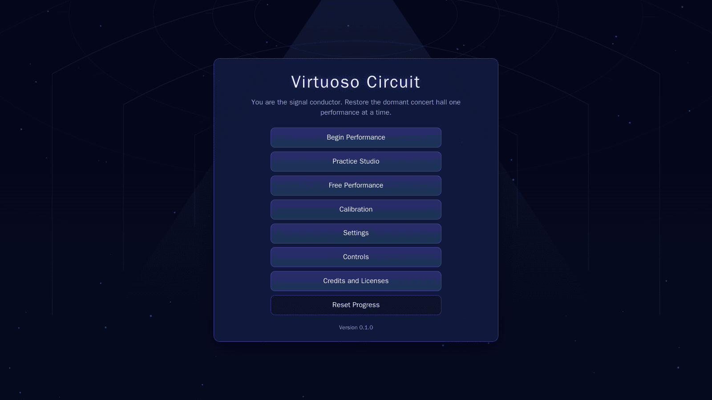
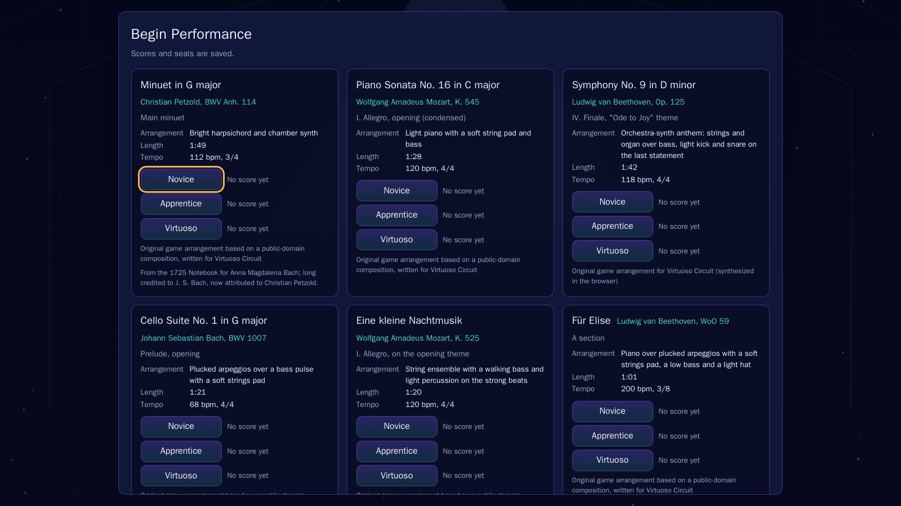
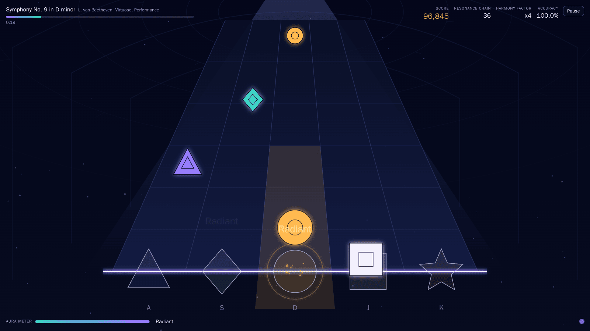
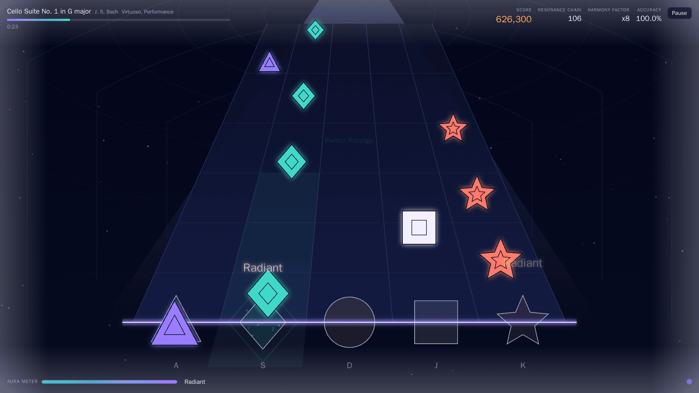
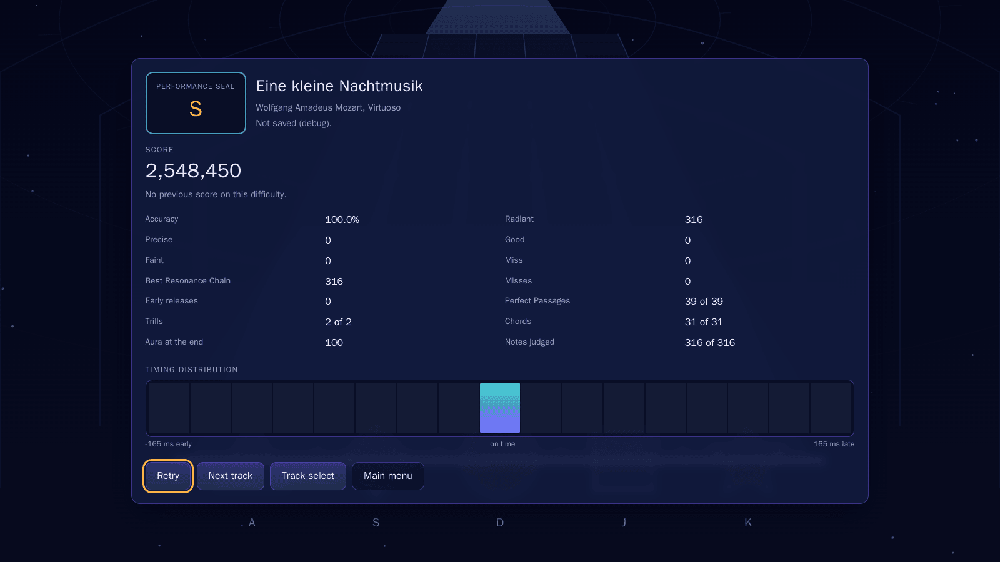
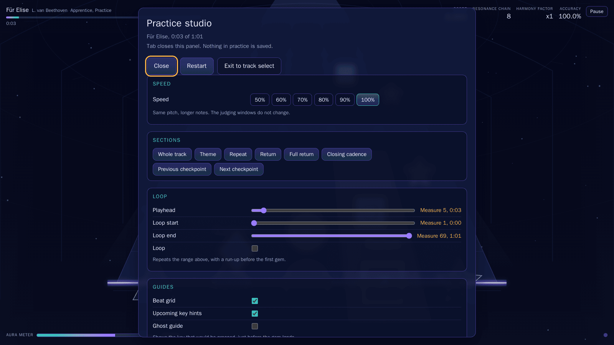
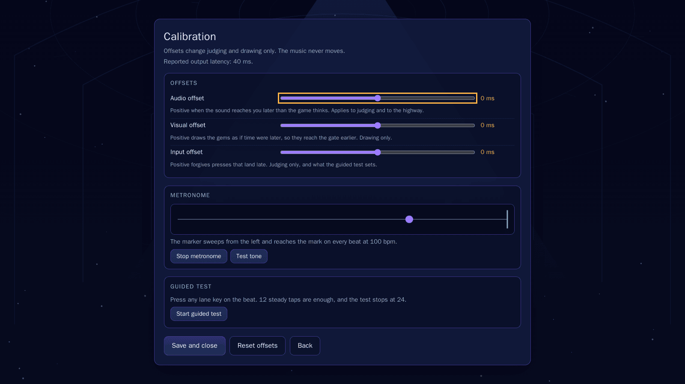
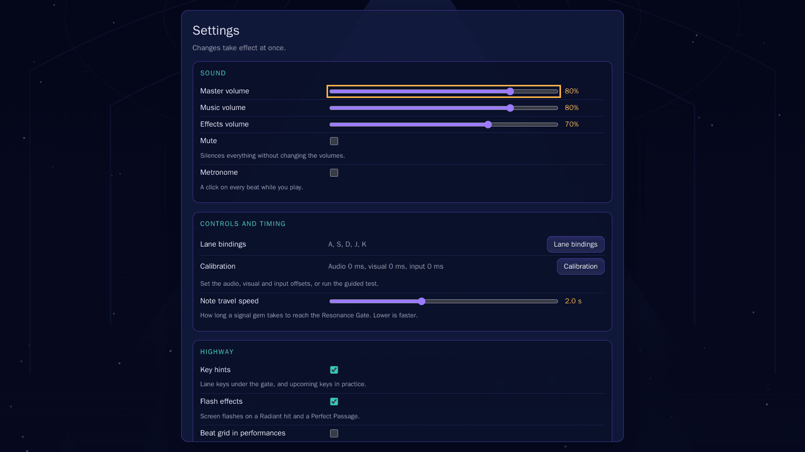
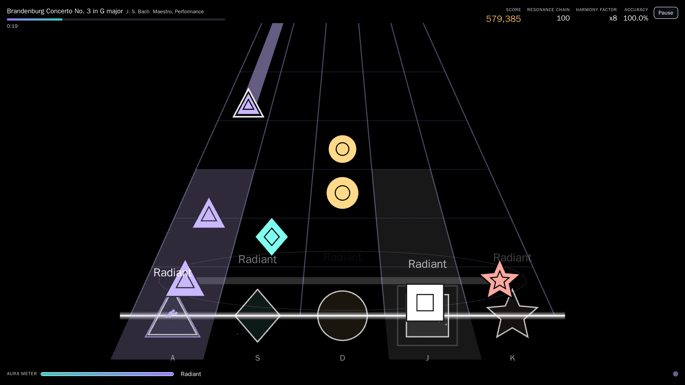
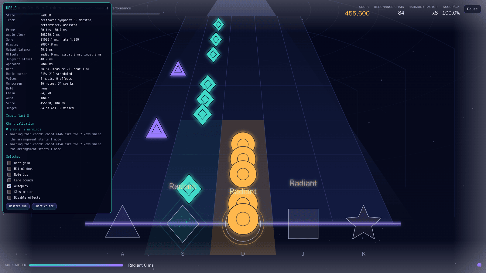

<p align="center"></p>

A five-lane keyboard rhythm game that runs in the browser. Notes fall down a corridor toward the Resonance Gate, you press the lane key as each one crosses it, and the score, the Resonance Chain and the Aura Meter follow from how close you were. The setting is a concert hall that has been dark a long time: you play the signal conductor, and finishing a piece lights another wing and opens the next track. Ten pieces, all public-domain classical, all stored as note data in this repository and synthesized by the browser while you play. TypeScript, Vite 6, Canvas 2D, Web Audio, vitest. No runtime dependencies and no media files: apart from the code, the only thing in the build is the hand-written SVG icon, and no sound, image or font is fetched or decoded.

## Tracks

| Composer | Work | Catalogue | Excerpt | Arrangement | Headline difficulty |
| --- | --- | --- | --- | --- | --- |
| Christian Petzold | Minuet in G major | BWV Anh. 114 | Main minuet | Bright harpsichord and chamber synth | Novice |
| Wolfgang Amadeus Mozart | Piano Sonata No. 16 in C major | K. 545 | I. Allegro, opening (condensed) | Light piano with a soft string pad and bass | Novice |
| Ludwig van Beethoven | Symphony No. 9 in D minor | Op. 125 | IV. Finale, "Ode to Joy" theme | Orchestra-synth anthem: strings and organ over bass, light kick and snare on the last statement | Novice |
| Johann Sebastian Bach | Cello Suite No. 1 in G major | BWV 1007 | Prelude, opening | Plucked arpeggios over a bass pulse with a soft strings pad | Apprentice |
| Wolfgang Amadeus Mozart | Eine kleine Nachtmusik | K. 525 | I. Allegro, on the opening theme | String ensemble with a walking bass and light percussion on the strong beats | Apprentice |
| Ludwig van Beethoven | Für Elise | WoO 59 | A section | Piano over plucked arpeggios with a soft strings pad, a low bass and a light hat | Apprentice |
| Johann Sebastian Bach | Toccata and Fugue in D minor | BWV 565 | Toccata, opening | Organ synth with a doubled pedal bass and a crash on the big chords | Virtuoso |
| Wolfgang Amadeus Mozart | Symphony No. 40 in G minor | K. 550 | I. Molto allegro, first theme | Tense strings and pulse percussion | Virtuoso |
| Ludwig van Beethoven | Symphony No. 5 in C minor | Op. 67 | I. Allegro con brio, opening | Percussive orchestra: string motif, organ brass, bass and drums | Virtuoso |
| Johann Sebastian Bach | Brandenburg Concerto No. 3 in G major | BWV 1048 | I. Allegro, opening ritornello | Fast ensemble strings over harpsichord and bass continuo | Maestro |

The table is in catalog order, which is the order the wings open in. The first three are unlocked from the start; every later track names the one before it in `metadata.unlockAfter` and stays sealed until that one is completed in a performance run. Each track carries a novice, an apprentice and a virtuoso chart; tracks 7 to 10 also carry a maestro chart. The headline difficulty in the last column is `metadata.difficulty`, the level the arrangement was pitched at. It is only a label: the track select card ignores it and lists every difficulty the track actually ships.

The Minuet in G is credited to Christian Petzold. It sits in the 1725 Notebook for Anna Magdalena Bach and was credited to Bach for about two centuries, which is how it ended up with a BWV Anhang number, and why the metadata carries an `attributionNote` that the credits screen prints.

## Install, run, build

```
npm install
npm run dev        # vite dev server on http://localhost:5173
npm run build      # tsc --noEmit, then vite build into dist/
npm run preview    # serve the built dist/
npm test           # vitest run, 398 tests across 24 files
npm run typecheck  # tsc --noEmit on its own
```

Built and tested on Node 22. `typescript`, `vite` and `vitest` are the only dependencies, all of them dev dependencies; there is no `dependencies` field and there is not meant to be one.

`vite.config.ts` sets `base: "./"`, so `dist/` works from any subdirectory of a static host without rewriting the paths. It still has to be served: the built page loads a module script, and browsers refuse those over `file://`. The package version is injected as `__APP_VERSION__` and shown at the foot of the main menu.

Debug tooling (the F3 overlay, the chart editor, `window.vc`) is on whenever `import.meta.env.DEV` is true, and can be turned on in a production build with `?debug=true`. The switch is `DEBUG_ENABLED` in `src/app/Config.ts`.

## How audio scheduling and timing sync work

Everything is timed against one clock, the `AudioContext`. `src/audio/AudioEngine.ts` is the only module that reads `ctx.currentTime`, and `src/audio/AudioClock.ts` turns that into song time with an anchor pair and a rate:

```
songMs = songAnchorMs + (audioMs - audioAnchorMs) * rate   while running
songMs = pausedSongMs                                      while paused
```

Song time is negative during the count-in and reaches 0 on the first beat. `AudioClock` never reads a real clock itself; it calls the time source it was handed, which is what lets `tests/clock.test.ts` and `tests/transport.test.ts` drive a whole run from a fake number.

`performance.now()` is a second timeline and is never used as a source of truth. It is reconciled against the audio clock by a single offset. `AudioEngine.sampleClock()` runs once per frame, pushes `audioMs - perfMs` into a ring of `AUDIO.clockSampleCount` (64) samples and takes the maximum of them as the offset in use. The maximum is the least delayed of the estimates: a sample taken on a frame that was itself late reads low, and averaging those in would drag every mapped input timestamp backwards. A sample more than `AUDIO.clockResyncMs` (100 ms) from the offset in use throws the whole ring away and starts again, which is how the mapping recovers after a suspended tab. Anything that asks for a time when the last sample is older than `AUDIO.clockSampleMaxAgeMs` (50 ms) triggers a fresh sample first.

Two functions read that offset, and they compute the same sum. `perfToAudioMs(perfMs)` is `perfMs + offset` and maps a keyboard event's `timeStamp` onto the audio timeline; `sampleClock()` applies it to the current performance time and returns the audio time the frame is drawn at. So the frame loop in `src/app/App.ts` and every press inside that frame go through one mapping, and a gem crossing the gate and a press at that moment agree by construction.

The music is scheduled ahead of the clock by `src/audio/TrackTransport.ts`, from a `setInterval` at `AUDIO.schedulerIntervalMs` (25 ms) rather than from `requestAnimationFrame`, so a dropped frame cannot drop a note. Each tick walks a cursor over the sorted arrangement and hands the synth everything inside the horizon:

```
horizon = songNow + AUDIO.lookaheadMs * rate
```

`AUDIO.lookaheadMs` is 200 ms of wall time, so in song time the horizon shrinks with the practice rate, which is what keeps a half-speed run from scheduling twice as much music per tick. A note whose audio time has already gone by more than `AUDIO.lateNoteDropMs` (50 ms) is skipped instead of started late: a voice crammed in behind its own onset is worse than a missing one. Anything less late than that starts at `max(scheduledAt, now)`.

Pausing stops the interval as well as the voices. A tick against a paused clock would measure the horizon from a stale anchor and drop the whole lookahead as late.

Every seek, resume or rate change goes through `resync()`, which silences the voices, moves the note cursor and the metronome cursor to the clock position with a binary search, and then re-triggers what should still be sounding. That last part is `retriggerSustained()`: it scans back `AUDIO.retriggerScanMs` (12 s), and any note with at least `AUDIO.retriggerMinRemainingMs` (150 ms) of song time left is started again part way through its envelope, using the synth's `offsetSec` parameter. Without it a long organ chord vanishes the moment you scrub the practice playhead into the middle of it.

The count-in clicks are booked at absolute audio times through `SoundEffects.playAt()`, which returns a cancel. `App.seekTo()` cancels them before re-anchoring the clock, because after a re-anchor those absolute times point at song positions that no longer mean anything.

If the context will not start within `AUDIO.unlockTimeoutMs` (500 ms) of a user gesture, the engine goes silent for the session and keeps a clock that continues the timeline the context was on, so nothing anchored to audio time jumps. The game stays playable, and the menu says so.

## How input is timestamped and judged

`src/input/InputManager.ts` listens on `window` in the capture phase, so a focused DOM element cannot swallow a lane key. The timestamp comes from `event.timeStamp`, which is the moment the key went down rather than the moment a frame noticed it. Values from the far past or the future (`ts < now - 1000` or `ts > now + 5`) come from synthetic events and a few odd browsers, and fall back to `now`.

`App.onLanePress` maps that stamp once:

```
songMs = clock.songMsAtAudioMs(engine.perfToAudioMs(perfTs))
```

and hands it to `RhythmGame.press(lane, songMs)`.

There are two offsets and they do different jobs.

The judgment offset decides when a note counts as hit. It is computed in the frame loop as

```
judgmentOffsetMs = (outputLatencyMs + audioOffsetMs + inputOffsetMs) * rate
```

and `src/gameplay/RhythmGame.ts` subtracts it once at the top of every entry point (`update`, `press`, `release`, `activateFocusSurge`). That is the only place calibration touches judging, which is why every other module can pass raw song time around.

The display offset decides where a gem is drawn:

```
displayMs = songMs - (outputLatencyMs + audioOffsetMs - visualOffsetMs) * rate
```

The two share the output latency and the audio offset and then part company: the input offset is judging only, the visual offset is drawing only, and the visual offset enters with the opposite sign because pushing display time backwards makes gems arrive at the gate earlier on screen.

Both scale with `rate`. The offsets are wall-clock quantities: the sound really does leave the speakers a fixed number of milliseconds late whatever speed the song is running at. At a practice rate of 0.5, a wall millisecond is half a song millisecond, so the correction expressed in song time has to be halved with it. Leaving the multiplication out would make every practice speed need its own calibration.

`RhythmGame.setJudgmentOffsetMs` has one wrinkle. A smaller offset moves the judgment frame forward over notes that now have no gate under them, with no song time behind them to sweep them. Those notes are marked skipped rather than left to become misses the player never had a chance at.

Judging a press is a per-lane search, in `src/gameplay/NoteScheduler.ts`. Each lane keeps a cursor, which is a hint and nothing more: `candidate()` first walks the cursor past notes that have left the pending state, then scans forward for the earliest still-pending note in that lane whose time is within the miss window of the press, and stops as soon as it passes `t + missWindow`. Because the scan never assumes notes are consumed in order, a seek, a practice loop or a key event that arrives out of order cannot desynchronise it. A press that matches nothing is ignored entirely rather than punished.

`src/gameplay/NoteJudge.ts` turns the signed delta (positive is late) into a judgment, and it is the only place a delta becomes one. The results histogram reads the faint window for its range, and nothing else in `src/gameplay/` touches the table. From `src/app/Config.ts`, symmetric in both directions:

| Judgment | Window | Score | Accuracy weight | Aura |
| --- | --- | --- | --- | --- |
| Radiant | 35 ms | 1000 | 1 | +1.5 |
| Precise | 75 ms | 750 | 0.9 | +1.0 |
| Good | 120 ms | 450 | 0.65 | +0.5 |
| Faint | 165 ms | 150 | 0.3 | +0.1 |
| Miss | 200 ms | 0 | 0 | -5 |

A press between 165 and 200 ms out consumes the note as a miss. Beyond 200 ms it belongs to no note. A note nobody pressed is auto-missed by `sweep()` once corrected song time passes `timeMs + 200`, oldest first; the handler can stop the walk, which is how a run that ends part way through leaves the rest of the chart pending instead of shredding it.

Scoring on top of that: the Harmony Factor is `1 + floor(chain / 10)` capped at 8, hold ticks pay 35 every 100 ms and are anchored to the chart rather than to the press (a completed hold always pays `floor(durationMs / 100)` ticks), a chord pays 250 when every lane of it resolves without a miss, a phrase pays 750, a trill phrase pays 300, and a Focus Surge needs a full Aura Meter and then doubles everything for 8 s, spending 50 aura as it runs. Releasing within `holdReleaseGraceMs` (100 ms) of the tail still completes the hold; releasing earlier costs 2 aura.

A lane can be reached by more than one key at once (see the fixed alternates below). `src/input/HeldKeyState.ts` holds the lane while any of its codes is down, so only the first key down presses and only the last key up releases. Rolling from the arrow key onto the letter key mid-hold does not drop the hold.

## How charts are stored and authored

Charts and arrangements are authored in beats and compiled to milliseconds once, at load. Nothing at runtime knows about beats except the debug readout and the beat grid.

A track is one module in `src/charts/tracks/` that default-exports a `TrackDefinition` (`src/charts/ChartTypes.ts`): metadata, a tempo map, sections, an arrangement, and up to four `BeatChart`s. `src/charts/BeatMapper.ts` turns a tempo map into segments and converts in both directions:

```
timeMs = segment.startMs + (beat - segment.startBeat) * 60000 / segment.bpm
```

A beat is the denominator of the time signature, so a beat is a quarter in 4/4 and an eighth in 3/8. `src/charts/ChartLoader.ts` compiles the arrangement into a flat, sorted `ScheduledNote[]`, derives `metadata.durationMs` from the last note plus a 400 ms tail, and compiles each `BeatChart` into a `CompiledChart` of `ChartEvent`s (`n0`, `n1`, ... by difficulty prefix) and `NoteInstance`s (`n0L2` for lane 2 of event `n0`). A chord is one event and several notes: the notes are what gets judged, the event is what pays the chord bonus.

The compact notation lives in `src/charts/Authoring.ts`. Music:

```ts
melody(0, "E4/1 E4 F4 G4 | G4 F4 E4 D4 | C4+E4/2 r/1 G3@0.5/1")
```

pitch, optional `+pitch` for a chord, optional `@velocity`, optional `/durationBeats`, with the duration sticky until changed, `r` for a rest, `|` ignored. Percussion parts use drum names (`k s h oh t cr rd cl`) in place of pitches. Lanes:

```ts
lanes(0, "0/1 1 2 [0,2]/1 1h/2 &3h/2 r/1 4!/0.5", "phrase-a")
```

a digit or a bracketed list for the lanes, `h` for a hold of the token's duration, `!` for an accent, `&` to place a token on the same beat as the previous one without advancing, `r` for a rest. The parser throws on a malformed token rather than skipping over it.

`src/charts/ChartValidator.ts` checks a compiled chart against the arrangement it belongs to and returns issues with a code and a level. The rules, in short: events sorted, non-negative and inside the track; lanes valid, unique and consistent with the event type; holds long enough and on one lane; chords within the size limit and never also holds; same-lane spacing measured from the end of the previous note in that lane; event spacing; a cap on how many keys have to be down at once (held tails count); a sliding one-second density window; phrase sanity, including trills that must alternate lanes; and every event landing within `CHART_ALIGNMENT_TOLERANCE_MS` (25 ms) of an actual arrangement note onset. That last rule is what stops a chart from asking for a key press over silence. Every code and what it means is in `docs/chart-format.md`.

The density limits are per difficulty, from `DENSITY_LIMITS` in `src/app/Config.ts`:

| | Novice | Apprentice | Virtuoso | Maestro |
| --- | --- | --- | --- | --- |
| Notes per second | 3.5 | 5 | 7 | 9 |
| Same-lane gap | 240 ms | 170 ms | 120 ms | 95 ms |
| Event gap | 200 ms | 140 ms | 95 ms | 80 ms |
| Chord size | 2 | 2 | 3 | 3 |
| Keys at once | 2 | 3 | 3 | 3 |
| Shortest hold | 400 ms | 350 ms | 300 ms | 250 ms |

`tests/tracks.test.ts` runs `validateTrack` over every module in `src/charts/tracks/` and fails the suite on any error. Warnings are printed rather than failed, because a few of them are judgement calls an author makes on purpose: the `thin-chord` warning fires when a chord asks for more keys than the arrangement has note onsets under it, usually a chart pattern reused over a thinner texture.

There are two seek operations, and `App.seekTo(ms)` calls both, in this order:

- `rearmFrom(ms)` puts every note at or after `ms` back on the highway: the runtime state is cleared and any judgment it had already earned is subtracted from the score, so replaying a passage does not double-count it. Chord and phrase trackers are rebuilt from the surviving note states, which means a phrase that lost a note can be earned again while one that is still intact keeps its bonus.
- `skipBefore(ms)` marks everything before `ms` that is still pending as skipped. Skipped notes drop out of `totalNotes` and out of the accuracy denominator, and they block any chord or phrase they belonged to. Without this, jumping into the middle of a track would auto-miss the whole first half the moment the sweep caught up.

Rearm is what makes a practice loop repeatable, and skip is what keeps a jump forward from counting notes that never came down. A practice loop wrap uses both: it seeks to the loop entry, which is the loop start minus a run-up of at least the approach setting so the first gem is not already half way down the corridor, and then skips again up to the loop start so the notes passed during the run-up do not count.

## How to add a track

1. Write `src/charts/tracks/<id>.ts` with a default export of type `TrackDefinition`. `src/charts/TrackCatalog.ts` picks it up with `import.meta.glob("./tracks/*.ts", { eager: true })` and sorts by `metadata.order`. Nothing else needs registering.
2. Fill in the metadata. `id` is lowercase-kebab and matches the filename. `order` is unique across the catalog. `bpm` should agree with the first tempo map entry, and `timeSignature` sets the beats per measure. `unlockAfter` names the previous track's id (leave it off for the first three); `chainUnlocks()` in `src/persistence/SaveManager.ts` re-resolves the gate against the catalog as it actually ships, so a build carrying a subset of the tracks still has a contiguous chain.
3. Write the arrangement as parts, each with an instrument from `INSTRUMENT_IDS` and an optional gain and pan. Two or more parts, please: `tests/tracks.test.ts` requires it. Aim for 55 to 125 seconds of music (`TRACK_LENGTH_MS`); outside that range the validator warns and `tests/tracks.test.ts` fails outright.
4. Write sections covering the piece from beat 0. They become the practice checkpoints and the loop presets.
5. Write charts for novice, apprentice and virtuoso, and for maestro too if `order >= 7`. Note counts have to increase with difficulty and each chart needs at least 40 notes. Every chart event must sit on an arrangement onset.
6. Fill in `arrangementCredit`, `scoreSourceCredit` and `licenseNotes`. The catalog credit test pins `arrangementCredit` to one exact string and requires `scoreSourceCredit` to say that no external MIDI or recording was used. Say honestly which bars are quoted and which were written for the arrangement.
7. Run `npx vitest run tests/tracks.test.ts`. Errors fail; read the warnings anyway.

In a debug build, F3 then "Chart editor" opens `src/ui/ChartEditor.ts`, which lists a chart against its beat grid, previews it at half speed, prints the validation report, and moves `TrackDefinition` JSON in and out so a definition can be checked before it is pasted back into a module. It reads the catalog and never writes it.

## How calibration works

None of this moves the music. The offsets change when a note counts as hit and where the gems are drawn.

`src/ui/CalibrationPanel.ts` holds three sliders, each clamped to +/-250 ms in 1 ms steps and each written straight through to `SettingsStore`:

- Audio offset, positive when the sound reaches you later than the game thinks. It is the one offset that feeds both the judgment offset and the display offset.
- Visual offset, drawing only. Positive draws the gems as if time were later, so they reach the gate earlier.
- Input offset, judging only. Positive forgives presses that land late. This is the one the guided test sets.

On top of the sliders the engine reads `ctx.outputLatency` when the browser reports a usable one, and falls back to `baseLatency` otherwise. `outputLatencySupported` says which happened, and the panel changes its advice accordingly: with no reported latency the guided test matters more than the sliders do.

The panel runs its own metronome at `GUIDED_CALIBRATION.bpm` (100), scheduled with the same lookahead pattern the transport uses, because a `setInterval` callback is not accurate enough to click on. A marker sweeps a strip and arrives at the target mark on each beat, corrected the same way the highway is, so watching it and hearing it agree.

The guided test measures how late your presses land. `src/audio/CalibrationManager.ts` is pure: it takes audio timestamps and returns numbers. Each tap has the output latency subtracted (you react to what you hear, and that lags the clock), is measured against the nearest beat, and is thrown out on the spot if it is more than `rejectBeyondMs` (180 ms) away. No user offset is applied during the measurement, since finding one is the point. When the test ends, the surviving taps are filtered again at `madFactor` (2.5) median absolute deviations from their median, and the median of what is left, rounded and clamped, becomes the suggested input offset. The test needs `minTaps` (12) steady taps to offer a suggestion and stops on its own at `maxTaps` (24).

The panel offers that number and leaves the decision to you. "Use this offset" writes `inputOffsetMs` and sets the `calibrated` flag in the save file; "Discard" leaves everything alone. "Save and close" sets the same flag without changing an offset, which is how the game knows not to nag. "Reset offsets" writes all three back to 0.

## How licensing and attribution are handled

Every piece of content the game plays or draws has a row in `src/licensing/AssetManifest.ts`: the composition status, where the note data came from, how sound is produced for it, why it may be used, and whether attribution is required. Track rows are generated from the track metadata (`licenseNotes` becomes the rationale, `scoreSourceCredit` becomes the source note), and three fixed rows cover the favicon, the interface and gameplay sounds, and the interface typeface.

Everything else reads that one list. `src/ui/CreditsPanel.ts` builds the in-game credits screen from it, and `ATTRIBUTION_AND_LICENSES.md` carries the same rows in the same order, with the per-track source notes broken out into their own section. The credits screen is generated and the markdown file is not, so when the two disagree the manifest is right. Composition credits and arrangement credits are kept in separate sections on purpose: the pieces are public domain, the note data and the sound are this project's own work, and those are different claims.

Nothing external is bundled or fetched: no recordings, no third-party MIDI files, no scanned editions. All audio is synthesized in the browser at runtime by `src/audio/SynthInstruments.ts` and `src/audio/SoundEffects.ts`. The icon is hand-written SVG in `public/favicon.svg` and the interface is set in a system font stack, so no font file is shipped either. A composition being public domain says nothing about any particular recording of it; the project avoids the question by not using recordings.

`tests/manifest.test.ts` checks that every catalog track has a row, that the composition credit and the arrangement credit are different strings, and that the non-track rows come last. `tests/tracks.test.ts` pins the shared arrangement credit and requires every source credit to state that nothing external was used.

## How to add themes, instruments and difficulties

A theme is a `Palette` in `src/render/Theme.ts`. There are two, `NEON_PALETTE` and `CONTRAST_PALETTE`, chosen by `palette(highContrast)`. Colours are literal strings picked once, because building an `rgba()` string per note would allocate on every frame; transparency at draw time comes from `ctx.globalAlpha`, and `palette.glow` set to false switches off every `shadowBlur` at once. A third look means a third `Palette`, a third judgment colour table beside `JUDGMENT_COLORS` in the same file, a third branch in `palette()`, `judgmentColor()` and `laneColor()`, and a third colour field on `LANE_IDENTITIES` in `src/app/Config.ts`. Lane identity is carried by shape first and colour second, so a new palette does not have to solve legibility on its own.

An instrument is a member of the `InstrumentId` union in `src/charts/ChartTypes.ts`, which must also be added to `INSTRUMENT_IDS` (the validator checks parts against that array). Then give it a case in the voice builder in `src/audio/SynthInstruments.ts` and an entry in the per-instrument `TRIM` table, which is what keeps the mix balanced without a mastering stage. Percussion is a special case: parts use the `DRUM` constants as pitches and the synth maps those to noise and envelope voices.

A difficulty is a member of the `Difficulty` union and of `DIFFICULTIES` in `src/charts/ChartTypes.ts`, and needs four more entries to be complete: a label in `DIFFICULTY_LABELS`, a limits row in `DENSITY_LIMITS` (both in `src/app/Config.ts`), an id prefix in `DIFFICULTY_PREFIX` in `src/charts/ChartLoader.ts`, and a place in the hardcoded list in `availableDifficulties()` in `src/charts/TrackCatalog.ts`. `compileTrack` throws on a chart filed under a key that disagrees with its own `difficulty` field, and on a difficulty outside the union, because either one would silently drop a chart or give it vacuous density limits. Which difficulties a track has to ship is a separate decision, made in `validateTrack`.

## Keyboard reference

Five lanes, left to right, with the shape that identifies each one:

| Lane | Name | Symbol | Default key | Fixed alternates |
| --- | --- | --- | --- | --- |
| 0 | Spire | Triangle | A | Left arrow |
| 1 | Prism | Diamond | S | Down arrow |
| 2 | Halo | Circle | D | Up arrow |
| 3 | Tile | Square | J | Right arrow |
| 4 | Nova | Star | K | Enter, Right shift |

The alternates are always live in addition to whatever you have bound, so an awkward primary map still plays with the arrows. A primary always wins: a key you bound to a lane is never also read as another lane's alternate.

Presets in the Controls screen (`KEYMAP_PRESETS`):

| Preset | Keys |
| --- | --- |
| Default | A S D J K |
| Left-hand compact | A S D F G |
| Split hands | S D F J K |
| Arrows | Left, Down, Up, Right, Enter |

Rebinding takes the keyboard for exactly one press. Escape cancels. A map that would break a rule is shown with the reason and never saved, so you cannot lock yourself out of a lane. Binding a key another lane already has swaps the two.

During a run:

| Key | What it does |
| --- | --- |
| Escape or P | Pause, and resume from the pause menu |
| R | Restart the run |
| Tab | Open and close the practice panel (practice mode only) |
| Space | Focus Surge |
| F1 | Performance readout, in any state |
| F3 | Debug overlay, in debug builds |

In the menus: arrow keys and Tab move focus, Enter or Space activates, Escape goes back or closes the dialog on top. Sliders and text fields keep the arrow keys that change their own value.

`RESERVED_KEYS` in `src/app/Config.ts` lists what can never be bound to a lane: Escape, F1, F3, F5, F11, F12, Tab, R, P, Space and the Control, Alt and Meta keys. Right shift is not on the list, because it is a fixed alternate for lane 4. F5, F11 and F12 always keep their browser behaviour, so reload, fullscreen and dev tools work even mid-run.

## Screenshots





















## Licence

MIT, see [LICENSE](LICENSE). Attribution for the music is a separate matter and is covered in [ATTRIBUTION_AND_LICENSES.md](ATTRIBUTION_AND_LICENSES.md).
